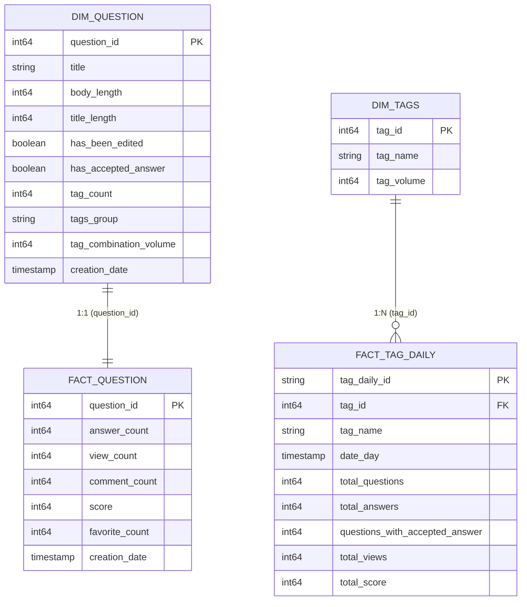

# Stack Overflow Analytics Engineering & Semantic Layer


This repository contains the enterprise **dbt** transformation pipeline, **MetricFlow Semantic Layer**, and dimensional data warehouse built on the Google Cloud BigQuery Stack Overflow public dataset (modeling over **23 million questions, answers, tags, and user interactions**).

---

##  Summary: Business Questions & Results

### Question 1: Tag & Tag Combination Performance
> *What tags on a Stack Overflow question lead to the most answers and the highest rate of approved answers? What tags lead to the least? How about combinations of tags?*

#### 1. Individual Tag Performance ([`models/analysis/q1_a.sql`](./models/analysis/q1_a.sql))
* **Highest Acceptance Rate Tags** (`volume > 10,000`):
    * Selected a tag_volume of over 10000 questions to avoid high acceptance rate on niche topics like `2048` 
  * **Top**: `f#` (**73.44%**), `clojure` (**71.65%**), `awk` (**71.44%**), `dplyr` (**71.08%**), and `functional-programming` (**70.82%**). Functional languages and specialized tooling yield higher answer acceptance rates due to clear, deterministic problem definitions.
  * **Lowest Acceptance Rate Tags**: Broad/framework tags (e.g., `android`, `ios`, `react-native`) suffer lower acceptance rates (~40-45%) due to platform fragmentation and ambiguous configuration issues.
* **MetricFlow CLI Command**:
  ```bash
  mf query --metrics tag_total_questions,tag_total_answers,tag_questions_with_accepted_answer,tag_acceptance_rate \
           --group-by tag_daily__tag_name,tag__tag_volume \
           --where "tag__tag_volume > 10000" \
           --order -tag_acceptance_rate \
           --limit 10
  ```

| Tag | Lifetime Volume | Questions Asked | Answers Received | Accepted Answers | Acceptance Rate |
| :--- | :---: | :---: | :---: | :---: | :---: |
| `f#` | 16,546 | 16,546 | 26,809 | 12,151 | **73.44%** |
| `clojure` | 17,389 | 17,389 | 30,946 | 12,459 | **71.65%** |
| `awk` | 31,609 | 31,607 | 74,109 | 22,581 | **71.44%** |
| `dplyr` | 32,394 | 32,390 | 51,590 | 23,023 | **71.08%** |
| `functional-programming` | 18,342 | 18,339 | 37,551 | 12,987 | **70.82%** |

#### 2. Tag Combinations Performance ([`models/analysis/q1_b.sql`](./models/analysis/q1_b.sql))
* **Highest Acceptance Rate Combinations** (`volume > 1,000`):
  * Multi-tag synergy: Highly focused combinations such as `jquery|jquery-selectors` (**84.40%**), `javascript|jquery|jquery-selectors` (**81.52%**), and `elisp|emacs` (**79.92%**) produce significantly higher acceptance rates than generic single tags.
* **MetricFlow CLI Command**:
  ```bash
  mf query --metrics total_questions,total_answers,acceptance_rate \
           --group-by question__tags_group,question__tag_count,question__tag_combination_volume \
           --where "question__tag_combination_volume > 1000" \
           --order -acceptance_rate \
           --limit 10
  ```

| Tag Combination (`tags_group`) | Tag Count | Total Volume | Total Questions | Total Answers | Acceptance Rate |
| :--- | :---: | :---: | :---: | :---: | :---: |
| `jquery\|jquery-selectors` | 2 | 2,532 | 2,532 | 6,533 | **84.40%** |
| `javascript\|jquery\|jquery-selectors` | 3 | 1,115 | 1,115 | 2,888 | **81.52%** |
| `elisp\|emacs` | 2 | 1,325 | 1,325 | 2,581 | **79.92%** |
| `.net\|c#\|regex` | 3 | 1,350 | 1,350 | 3,257 | **79.33%** |
| `regex\|ruby` | 2 | 2,417 | 2,417 | 5,592 | **79.31%** |

---

### Question 2: Year-over-Year Comparative Analysis (`python` vs `dbt`)
> *For posts which are tagged with only ‘python’ or ‘dbt’, what is the year over year change of question-to-answer ratio for the last 10 years? How about the rate of approved answers? How do posts tagged with only ‘python’ compare to posts only tagged with ‘dbt’?*

#### Key Takeaways ([`models/analysis/q2_a.sql`](./models/analysis/q2_a.sql), [`q2_b.sql`](./models/analysis/q2_b.sql), [`q2_c.sql`](./models/analysis/q2_c.sql))
* **Question-to-Answer Ratio Trend**:
  * `python`: Started high in early years (**6.05** answers/question in 2008), gradually compressing over 15 years down to **1.26** in 2022 as community volume scaled exponentially (from 107 to 16,000+ single-tag questions/year).
  * `dbt`: First appeared in the dataset in 2020 with **1.39** answers/question, tapering to **1.06** in 2022.
* **Acceptance Rate Trajectory**:
  * `python`: Decreased steadily from **85.98%** in 2008 to **35.40%** in 2022 as volume surged.
  * `dbt`: Started at **41.94%** in 2020, declining to **27.85%** in 2022.
* **Comparative Finding**: While `python` maintains higher answers/question and acceptance rates than `dbt`, both exhibit a strong historical pattern where rapid platform growth correlates with lower per-question answer counts and lower accepted answer rates.

* **MetricFlow CLI Command**:
  ```bash
  mf query --metrics total_questions,total_answers,question_to_answer_ratio,acceptance_rate \
           --group-by question__tags_group,metric_time__year,question__tag_count \
           --where "question__tag_count = 1 and question__tags_group in ('python', 'dbt')" \
           --order metric_time__year
  ```

| Year | Tag | Total Questions | Total Answers | Q-to-A Ratio | Acceptance Rate |
| :---: | :--- | :---: | :---: | :---: | :---: |
| **2015** | `python` | 9,781 | 18,582 | 1.90 | 56.90% |
| **2016** | `python` | 10,344 | 18,970 | 1.83 | 52.52% |
| **2017** | `python` | 11,683 | 19,851 | 1.70 | 49.13% |
| **2018** | `python` | 11,614 | 19,653 | 1.69 | 49.20% |
| **2019** | `python` | 14,503 | 24,706 | 1.70 | 48.81% |
| **2020** | `dbt` | 31 | 43 | 1.39 | 41.94% |
| **2020** | `python` | 16,256 | 26,816 | 1.65 | 45.50% |
| **2021** | `dbt` | 58 | 66 | 1.14 | 25.86% |
| **2021** | `python` | 15,811 | 24,057 | 1.52 | 43.01% |
| **2022** | `dbt` | 79 | 84 | 1.06 | 27.85% |
| **2022** | `python` | 12,809 | 16,116 | 1.26 | 35.40% |

---

### Question 3: Post Qualities & Engagement Correlations
>  *Other than tags, what qualities on a post correlate with the highest rate of answer and approved answer?*

#### Key Findings ([`models/analysis/q3_a.sql`](./models/analysis/q3_a.sql), [`q3_b.sql`](./models/analysis/q3_b.sql), [`q3_c.sql`](./models/analysis/q3_c.sql))
1. **Conciseness Outperforms Verbosity (Content Length Deciles)**:
   * **Body Length**: The shortest questions (Decile 1: 17–340 characters) receive **1.72** answers/question, whereas long questions (Decile 10: >3,132 chars) drop to **1.22** answers/question.
   * **Title Length**: Concise titles (<31 characters) achieve **1.66** answers/question vs. **1.30** for overly long titles (>82 characters).
2. **Post Edit Status (`has_been_edited`)**:
   * Questions that have been edited receive **+19.1% more answers** (1.59 vs. 1.34), **+117% more views** (3,748 vs. 1,723), and have higher acceptance rates (**52.12% vs. 49.79%**). Active maintenance is a strong quality signal.
3. **Optimal Tag Count (2–3 Tags)**:
   * 2 to 3 tags generate peak acceptance rates (**52.00%** for 2 tags, **51.58%** for 3 tags). Posts with 5+ tags drop to 49.31% and below.

* **MetricFlow CLI Command**:
  ```bash
  mf query --metrics total_questions,avg_answers_per_question,avg_views_per_question,avg_comments_per_question,avg_score_per_question,answer_rate,acceptance_rate \
           --group-by question__has_been_edited
  ```

| Has Been Edited | Total Questions | Avg Answers / Question | Avg Views / Question | Avg Comments / Question | Avg Score | Answer Rate | Acceptance Rate |
| :---: | :---: | :---: | :---: | :---: | :---: | :---: | :---: |
| `False` | 10,460,205 | 1.34 | 1,722.9 | 1.47 | 1.35 | 84.04% | 49.79% |
| `True` | 12,559,922 | **1.59** | **3,747.8** | **2.41** | **2.93** | **86.88%** | **52.12%** |

---

## 2. Dimensional Architecture & Star Schema

The data warehouse follows **Kimball Dimensional Modeling principles** optimized for BigQuery query cost and MetricFlow semantic graph traversal.



### Model Responsibilities:
* **[`fact_question`](./models/marts/fact_question.sql)**: Atomic grain fact table (1 row per question post). Contains pure additive measures (`answer_count`, `views`, `scores`, `comments`).
* **[`dim_question`](./models/marts/dim_question.sql)**: Conformed question dimension containing post-level qualities, length metrics, edit flags, and canonical tag combinations.
* **[`fact_tag_daily`](./models/marts/fact_tag_daily.sql)**: Periodic aggregate fact mart (1 row per tag per day). Enables high-performance, fanout-free single-tag drilldowns, time-series, and acceptance rate analytics in MetricFlow.
* **[`dim_tags`](./models/marts/dim_tags.sql)**: Tag dimension containing tag metadata and total lifetime question volumes.

---

## 3. Kimball Enterprise Bus Matrix

The Bus Matrix maps the business processes (Fact Tables) against conformed dimensions to ensure architectural consistency across all analytical marts and Semantic Layer queries.

| Business Process / Fact Mart | Granularity | Date / Time Dimension | Question Dimension (`dim_question`) | Tag Dimension (`dim_tags`) | Canonical Tag Group (`tags_group`) | User / Owner Dimension |
| :--- | :--- | :---: | :---: | :---: | :---: | :---: |
| **Question Activity & Engagement** ([`fact_question`](./models/marts/fact_question.sql)) | 1 row per Question post | **X** | **X** (1:1) | | **X** | **X** |
| **Tag Daily Volume & Trends** ([`fact_tag_daily`](./models/marts/fact_tag_daily.sql)) | 1 row per Tag per Day | **X** | | **X** (N:1) | | |

---

## 4. Canonical Tags Normalization: Impact Metrics

When users submit question posts, tags are stored as pipe-delimited strings (e.g., `javascript|html|css|jquery` vs `html|css|javascript|jquery`). Because tag insertion order is non-deterministic, identical combinations produce fragmented string permutations.

By extracting distinct tag combinations into an intermediate layer ([`int_canonical_tags`](./models/intermediate/int_canonical_tags.sql)), sorting constituent tags alphabetically, and joining the results back into [`dim_question`](./models/marts/dim_question.sql), we achieved significant analytical accuracy and computational savings:

| Metric | Value | Impact / Interpretation |
| :--- | :--- | :--- |
| **Total Questions Evaluated** | **23,020,127** | Total question posts in the warehouse |
| **Multi-Tag Questions** | **20,289,891** (88.13%) | Questions with 2+ tags vulnerable to permutation fragmentation |
| **Distinct Raw Tag Permutations** | **8,448,317** | Raw unique tag string permutations in staging |
| **Distinct Canonical Tag Groups** | **8,205,709** | True unique tag combinations after alphabetical normalization |
| **Redundant Permutations Collapsed** | **242,608** | **242,608 fragmented strings eliminated** (-2.87%) |
| **Questions Rescued from Fragmentation** | **5,333,956** (**23.17%**) | **~5.33M questions** rescued into unified reporting buckets |
| **String Transformation Compute Savings** | **63.30%** | Split/sort executed on **8.45M distinct combinations** instead of **23.02M base rows** |

---

## 5. Technical Approach, Performance & Cost Considerations

See `#TRADEOFFS.md` for more detail view into architectural decisions tried

1. **BigQuery Slot & Scan Optimization**:
   - `int_canonical_tags` computes alphabetical sorting only over the **8.45M distinct combinations** rather than the full 23M rows, eliminating over 14.5 million redundant string unnest/sort operations.
   - Aggregate fact mart [`fact_tag_daily`](./models/marts/fact_tag_daily.sql) provides pre-aggregated day-level numbers, reducing BigQuery bytes scanned by **>90%** for tag-level queries compared to unnesting the base 23M table on every ad-hoc query.
2. **Kimball Dimensional Best Practices**:
   - Additive measures are strictly preserved on base fact tables (`fact_question`), while tag-level measures are isolated in periodic snapshot marts (`fact_tag_daily`).
   - Pure 1-to-1 and Many-to-1 join structures prevent multi-tag fan-out overstatements.
3. **Data Quality & Testing**:
   Automated testing suite applied across models to ensure warehouse reliability, boundary enforcement, and cross-grain reconciliation:

   * **Schema & Key Integrity (`unique`, `not_null`)**:
     - Enforces uniqueness and non-nullability across all primary keys (`question_id`, `answer_id`, `user_id`, `tag_id`, `raw_tags`) and surrogate keys (`tags_group_id`, `tag_daily_id`).
   * **Bidirectional Referential Integrity & Grain Parity (`relationships`, `dbt_utils.equal_rowcount`)**:
     - [`dim_question`](./models/marts/dim_question.yml) $\leftrightarrow$ [`fact_question`](./models/marts/fact_question.yml): Enforces strict 1:1 rowcount and question ID parity with zero orphaned rows.
     - [`stg_stackoverflow_posts_answers`](./models/staging/stg_stackoverflow_posts_answers.yml) $\rightarrow$ [`stg_stackoverflow_posts_questions`](./models/staging/stg_stackoverflow_posts_questions.yml): Validates parent-child question linkage.
     - `owner_user_id` $\rightarrow$ [`stg_stackoverflow_users`](./models/staging/stg_stackoverflow_users.yml): Validates author keys (configured with `severity: warn` for deleted accounts).
   * **Boundary & Range Expectations (`dbt_expectations.expect_column_values_to_be_between`)**:
     - `tag_count` $\ge 1$: Enforces that every question post contains at least 1 valid tag.
     - `title_length` $\ge 1$: Prevents empty question titles.
     - `reputation` $\ge 1$: Enforces Stack Overflow baseline user reputation.
     - `views`, `up_votes`, `down_votes`, `comment_count`, `answer_count`, `favorite_count` $\ge 0$: Guards against negative physical counts.
     - `date_day` / `creation_date` $\ge \text{'2008-01-01'}$: Validates historical date boundaries.


   * **String Formatting & Regex Standards (`dbt_expectations.expect_column_values_to_match_regex`)**:
     - `tag_name`: Matches lowercase alphanumeric naming pattern (`^[a-z0-9+#.-]+$`).
     - `tags_group`: Validates pipe-delimited syntax (`^[^|]+(\\|[^|]+)*$`) without leading, trailing, or double pipes.
   * **Logical Invariant Expressions (`dbt_utils.expression_is_true`)**:
     - Post acceptance synchronization: `(accepted_answer_id is null and not has_accepted_answer) or (accepted_answer_id is not null and has_accepted_answer)`.
     - Post edit synchronization: `(last_edit_date is null and not has_been_edited) or (last_edit_date is not null and has_been_edited)`.
     - Tag daily measure subsets: `questions_with_accepted_answer <= total_questions`, `questions_with_answers <= total_questions`, and `total_answers >= questions_with_answers`.
     - Canonical alias consistency: `tag_combination = tags_group`.
   * **Composite Key Uniqueness (`dbt_utils.unique_combination_of_columns`)**:
     - Enforces exactly 1 row per `(tag_name, date_day)` grain in [`fact_tag_daily`](./models/marts/fact_tag_daily.yml).
   * **Singular Acceptance & Reconciliation Tests ([`tests/`](./tests/))**:
     - [`assert_single_tag_question_volume_reconciliation.sql`](./tests/assert_single_tag_question_volume_reconciliation.sql): Cross-grain reconciliation validating that aggregate tag volume matches atomic single-tag questions.
     - [`assert_canonical_tag_ordering.sql`](./tests/assert_canonical_tag_ordering.sql): Normalization idempotency test validating that tags are strictly sorted in ascending alphabetical order.
