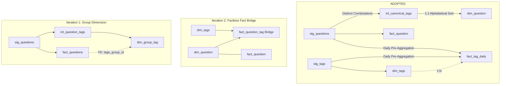

# Data Warehouse Architectural Decisions & Tradeoffs

This document chronicles the architectural journey, dimensional modeling decisions, and technical tradeoffs evaluated throughout the development of the Stack Overflow analytics data warehouse and dbt Semantic Layer (MetricFlow).


## 1. Executive Summary & Evolution Timeline

The repository evolved across ten distinct development iterations, moving from initial exploratory prototypes to an enterprise-grade Kimball dimensional warehouse and semantic layer modeling over **23 million Stack Overflow question posts, answers, tags, and user interactions**:


| Decision Area | Initial Approach | Problem Encountered | Final Implemented Architecture |
| :--- | :--- | :--- | :--- |
| **Question Modeling** | Monolithic `fact_questions` containing both attributes and measures. | Prevented reuse of question attributes across other business events (`fact_answers`, `fact_votes`); created fact-to-fact joins. | Separated into conformed `dim_question` (1:1 entity) and atomic `fact_question` (measures). |
| **Many-to-Many Tag Grain** | Factless Fact Bridge (`fact_question_tag`, 68M+ rows). | Fanout risk on additive measures; query scan latency on 23M base rows; MetricFlow multi-hop join ambiguity. | Split into **`fact_tag_daily`** (periodic aggregate fact) for single-tag slicing and **`int_canonical_tags`** for combination slicing. |
| **Tag Combinations** | Raw surrogate key `dbt_utils.generate_surrogate_key(['tags'])` on raw pipe string. | Non-deterministic ordering (`python\|pandas` vs `pandas\|python`) created 242,608 duplicate permutations. | Pre-aggregated distinct string unnest + alphabetical sort in `int_canonical_tags`, rescuing 5.33M questions. |
| **Semantic Layer** | Centralized `models/metrics/semantic_models.yml`. | Decoupled dbt tests and documentation from semantic entity and measure metadata. | Co-located `semantic_models` blocks directly in each mart's `.yml` file; centralized business metrics in `metrics.yml`. |

---

## 2. Deep Dive: The Factless Schema & Bridge Table Evolution

Handling Many-to-Many (M:N) relationships between questions and tags represents the central modeling challenge in Stack Overflow data. Each question can have 1 to 5 tags, and each tag is shared across millions of questions. Over the course of the project, three distinct patterns were implemented, tested, and evaluated:



---

### Iteration 1: Intermediate Unnesting & Group Dimension (`dim_group_tag`)

* **Implementation**:
  - Created `models/intermediate/int_question_tags.sql` by unnesting `split(tags, '|')`.
  - Exposed `models/marts/dim_group_tag.sql` keyed on `tags_group_id` (a surrogate key generated from the raw `tags` column).
  - Joined `fact_questions` to `dim_group_tag` on `tags_group_id`.

* **Why it was tried**:
  - The goal was to preserve the single-row-per-question granularity of the fact table while delegating multi-tag resolution to a separate dimension table.

* **Why it was discarded**:
  1. **Tag Order Permutation Explosion**: Because tags were concatenated in the order users typed them, `python|pandas` and `pandas|python` generated completely different surrogate keys (`tags_group_id`). This split identical tag groups across distinct dimension keys, ruining combination analysis.
  2. **Unnecessary Intermediate Volume**: Unnesting full question datasets (23M rows) in an intermediate view to build a group dimension caused massive BigQuery memory consumption and redundant string computations.
  3. **Rigid Query Patterns**: Queries filtering by single tags still had to perform expensive pattern matching or join against multi-row groups.

---

### Iteration 2: Textbook Kimball Bridge / Factless Fact (`fact_question_tag`)

* **Implementation** :
  - Removed `dim_group_tag` and replaced it with a standard Kimball factless fact table: `models/marts/fact_question_tag.sql`.
  - Grain: **1 row per question per tag** (~68 million rows across the 23M questions).
  - Schema:
    ```sql
    select
        {{ dbt_utils.generate_surrogate_key(['question_id', 'tag_id']) }} as question_tag_id,
        question_id,    -- FK to dim_question
        tag_id,         -- FK to dim_tags
        tag_name,
        creation_date
    from unnested_tags
    ```

* **Why it was tried**:
  - In traditional relational data warehousing, a bridge table is the textbook solution for Many-to-Many relationships. It decouples the Question dimension from the Tag dimension cleanly without modifying the grain of either table.

* **Why it was discarded for single-tag slicing**:
  1. **The Measure Fan-Out Trap**:
     - When analysts or BI tools join `fact_question` (23M rows) to `fact_question_tag` (68M rows) to calculate total views, answers, or scores by tag, additive metrics are duplicated across every tag on a question. A question with 5 tags multiplies its `view_count` and `score` by 5x unless queries apply non-standard `COUNT(DISTINCT)` or complex window weights.
  2. **MetricFlow Semantic Layer Incompatibility**:
     - MetricFlow requires clear DAG traversal paths. Traversing `dim_tags -> fact_question_tag (bridge) -> fact_question` to aggregate measures created semantic ambiguities and required complicated multi-hop entity definitions that MetricFlow could not resolve reliably.
     - When defining tag-specific metrics (e.g., `tag_acceptance_rate`), MetricFlow had to perform full multi-table joins across 68M+ rows for every time-series slice.
  3. **High Query Latency & BigQuery Scan Cost**:
     - Every single-tag lookup (such as analyzing `python` vs `dbt`) required scanning and joining the 68M-row bridge table against the 23M-row fact table, consuming tens of gigabytes per query.

---

### Iteration 3: The Optimized Architecture (`fact_tag_daily` + `int_canonical_tags`)

* **Implementation**:
  - Discarded `fact_question_tag` in favor of a specialized two-pronged dimensional architecture:
    1. **Single-Tag Analytics & Time-Series**: Built `models/marts/fact_tag_daily.sql`, a periodic snapshot aggregate fact mart at the grain of **1 row per Tag per Day**.
    2. **Multi-Tag Combination Analytics**: Built `models/intermediate/int_canonical_tags.sql` to normalize tag combinations alphabetically, joining them 1:1 into `models/marts/dim_question.sql`

* **Why this architecture is superior**:

| Evaluation Criteria | Factless Fact Bridge (`fact_question_tag`) | Adopted Architecture (`fact_tag_daily` + Canonical `dim_question`) |
| :--- | :--- | :--- |
| **Additive Measure Safety** | ❌ High risk of fanout multiplication (1:N join doubles/triples views and answers). | ✅ **100% fanout-free**. `fact_tag_daily` pre-aggregates at tag grain; `dim_question` maintains strict 1:1 grain. |
| **BigQuery Scan Volume** | ❌ Scans 68M bridge rows + 23M fact rows on every ad-hoc tag query (~5–15 GB/query). | ✅ Scans compact daily aggregate table (<500 MB), **reducing bytes scanned by >90%**. |
| **MetricFlow Simplicity** | ❌ Requires multi-hop bridge join definitions and distinct count workarounds. | ✅ Clean, direct semantic measures on `fact_tag_daily` (`tag_total_questions`, `tag_total_answers`, `tag_acceptance_rate`). |
| **Combination Analysis** | ❌ Requires self-joins on bridge table to find multi-tag co-occurrences. | ✅ Direct filtering on `dim_question.tags_group` (e.g., `jquery\|jquery-selectors`). |
| **Permutation Integrity** | ❌ Raw tag strings fragmented across 242,608 duplicate permutations. | ✅ Alphabetical sorting unifies 5.33M fragmented questions into canonical groups. |

---

## 3. The 1:1 Grain Separation: `dim_question` vs. `fact_question`

In the final schema, both `models/marts/dim_question.sql``models/marts/fact_question.sql` share the exact same primary key and granularity: **`question_id` (1 row per question post)**.

```mermaid
erDiagram
    DIM_QUESTION ||--|| FACT_QUESTION : "1:1 (question_id)"
    DIM_QUESTION ||--o{ FACT_ANSWERS : "1:N (question_id - Future)"
    DIM_QUESTION ||--o{ FACT_VOTES : "1:N (question_id - Future)"
    DIM_QUESTION ||--o{ FACT_COMMENTS : "1:N (question_id - Future)"
    DIM_QUESTION ||--o{ FACT_POST_EDITS : "1:N (question_id - Future)"

    DIM_QUESTION {
        int64 question_id PK
        string title
        int64 body_length
        int64 title_length
        boolean has_been_edited
        boolean has_accepted_answer
        int64 tag_count
        string tags_group
        int64 tag_combination_volume
        timestamp creation_date
        timestamp last_activity_date
        timestamp last_edit_date
        int64 owner_user_id FK
        int64 accepted_answer_id FK
    }

    FACT_QUESTION {
        int64 question_id PK_FK
        timestamp creation_date
        int64 accepted_answer_id FK
        int64 score
        int64 view_count
        int64 answer_count
        int64 comment_count
        int64 favorite_count
    }

    FACT_ANSWERS {
        int64 answer_id PK
        int64 question_id FK
        int64 owner_user_id FK
        int64 score
        boolean is_accepted
        timestamp creation_date
    }

    FACT_VOTES {
        int64 vote_id PK
        int64 question_id FK
        int64 vote_type_id
        timestamp creation_date
    }
```

### The Problem with Monolithic Fact Tables
In early commits, all columns were packaged into a single table: `fact_questions.sql`. This table contained descriptive text attributes (`title`, `body_length`, `title_length`, `has_been_edited`), lifecycle timestamps, foreign keys, and numeric facts (`score`, `view_count`, `answer_count`, `comment_count`).

While convenient for simple one-off queries, a monolithic fact table violates foundational dimensional modeling principles and creates severe architectural bottlenecks as the warehouse expands.

---

### Why Separate at the Exact Same Grain?

1. **Clear Division of Responsibilities (Facts vs. Dimensions)**:
   - **`fact_question`** is an **atomic transaction fact table**. It contains pure numeric, additive, and semi-additive business metrics resulting from user activity on a question (`view_count`, `score`, `answer_count`, `comment_count`, `favorite_count`).
   - **`dim_question`** is a **conformed dimension table**. It contains descriptive context, entity attributes, categorizations, text lengths, and foreign key references that define *who*, *what*, *when*, and *how* the question was framed.

2. **Columnar Database (BigQuery) Performance & Cost**:
   - Analytics queries aggregating platform-level metrics (`SUM(answer_count)`, `AVG(score)`) only need to scan narrow integer columns in `fact_question`. They do not scan wide string columns, tag arrays, or text descriptors, minimizing BigQuery byte scan costs.

---

### `dim_question` as a Conformed Dimension in Kimball Bus Architecture

As the Stack Overflow data warehouse matures, new business processes and event fact tables are integrated into the data model:
- **`fact_answers`** (Grain: 1 row per answer posted): Measures answer submission latency, answer word count, and author reputation.
- **`fact_votes`** (Grain: 1 row per upvote/downvote event): Measures voting velocity, vote timestamps, and score trends over time.
- **`fact_comments`** (Grain: 1 row per comment posted): Measures discussion depth and response times.
- **`fact_post_edits` / `fact_post_history`** (Grain: 1 row per revision event): Measures question maintenance frequency and text churn.

In this mature architecture, **`dim_question` serves as the Conformed Dimension linking all of these distinct business processes together**.

---

### Eliminating the "Fact-to-Fact Join" Anti-Pattern

Without `dim_question` as a dedicated conformed dimension, answering common business questions creates dangerous **Fact-to-Fact joins**:

> **Scenario**: *"What is the vote velocity (`fact_votes`) or answer count (`fact_answers`) on questions with 3+ tags, or questions with body length > 1,000 characters?"*

```text
❌ ANTI-PATTERN (Fact-to-Fact Join):
[fact_votes]  <────── (Join on question_id) ──────>  [fact_questions]
   (Fact)                                                 (Fact)
   * Causes metric duplication, Cartesian explosions, and breaks BI query generators.

✅ CONFORMED STAR SCHEMA:
[fact_votes]       ─── (FK question_id) ───┐
[fact_answers]     ─── (FK question_id) ───┼───> [dim_question] (Conformed Dimension)
[fact_comments]    ─── (FK question_id) ───┤          ▲
[fact_question]    ─── (FK question_id) ───┘          │
                                                (Single Source of Truth)
```

By having `dim_question` as an independent conformed dimension:
- Every event fact table (`fact_answers`, `fact_votes`, `fact_comments`) holds a foreign key `question_id` pointing to `dim_question`.
- Analysts can slice answers, votes, comments, and edits by any question attribute (e.g., `tags_group`, `tag_count`, `has_been_edited`, `body_length`) without ever joining two fact tables together.

---

### MetricFlow Semantic Graph Traversal Requirements

dbt Semantic Layer (MetricFlow) builds a formal semantic graph where entities define join paths:
- In [`models/marts/dim_question.yml`](file:///home/jvazquez/Documents/takehome_ae/models/marts/dim_question.yml), `dim_question` declares a **Primary Entity**:
  ```yaml
  entities:
    - name: question
      type: primary
      expr: question_id
  ```
- In [`models/marts/fact_question.yml`](file:///home/jvazquez/Documents/takehome_ae/models/marts/fact_question.yml), `fact_question` declares a **Foreign Entity**:
  ```yaml
  entities:
    - name: question
      type: foreign
      expr: question_id
  ```
- Future fact tables (`fact_answers`, `fact_votes`) will declare `question` as a foreign entity.

This strict entity typing allows MetricFlow to automatically traverse from measures in `fact_question` or `fact_answers` to dimensions in `dim_question` using valid 1:N or 1:1 join paths without circular join loops or invalid fanouts.

---

## 4. Other Architectural Decisions Tried and Discarded

### Tradeoff A: Raw String Hashing vs. Multi-Pass Canonical Normalization

* **What was tried initially**:
  - In staging (`stg_stackoverflow_posts_questions`), generated `tags_group_id` directly using `dbt_utils.generate_surrogate_key(['tags'])` on the raw pipe-delimited string.

* **Why it was discarded**:
  - In Stack Overflow, users can apply tags in arbitrary order. `|python|pandas|` and `|pandas|python|` are identical in business meaning, but generated completely different hash keys.
  - Across the 23M questions, this created **242,608 duplicate permutations**, artificially fragmenting 5.33M questions (23.2% of the dataset) and corrupting combination rankings (such as Q1_b).

* **Adopted Solution** (`int_canonical_tags.sql`):
  - Rather than sorting all 23M rows in staging, `models/intermediate/int_canonical_tags.sql` extracts only the **8.45M distinct tag strings**, unrolls them, sorts tags alphabetically using `array_agg(tag order by tag)`, and generates the canonical surrogate key.
  - **Performance Win**: Reduced string transformation compute by **63.30%** (processing 8.45M rows instead of 23.02M) while collapsing all 242,608 redundant permutations into unified reporting buckets.

---

### Tradeoff B: Staging Boundary Naming & Type Contracts

* **What was tried initially**:
  - Staging models passed through source column names verbatim (`id`, `count`, `post_id`, mixed case strings).

* **Why it was improved**:
  - Ambiguous primary keys (`id`) across multiple tables caused naming collisions during joins.
  - Case sensitivity inconsistencies in tags (e.g., `Python` vs `python`) caused tag count fragmentation.
  - **Adopted Solution**:
    - Normalized all primary and foreign keys at the staging layer (`stg_stackoverflow_posts_questions.sql`, `stg_stackoverflow_tags.sql`): `question_id`, `tag_id`, `user_id`, `accepted_answer_id`.
    - Enforced lowercase tag sanitization (`lower(tags)`), length calculations, and boolean flags (`has_accepted_answer`, `has_been_edited`) directly at the staging boundary.

---

## 5. Summary Bus Matrix & Future Warehouse Roadmap

The final enterprise architecture aligns with the **Kimball Enterprise Bus Matrix**, ensuring that conformed dimensions can be shared across all present and future business process facts:

| Business Process / Fact Table | Granularity | Time Dimension | Conformed Question Dimension (`dim_question`) | Tag Dimension (`dim_tags`) | Conformed User Dimension (`stg_users`) | Status |
| :--- | :--- | :---: | :---: | :---: | :---: | :---: |
| **Question Facts** (`fact_question`) | 1 row per Question | **X** | **X** (1:1 Primary) | | **X** (FK) | **Implemented** |
| **Tag Daily Trends** (`fact_tag_daily`) | 1 row per Tag per Day | **X** | | **X** (1:N) | | **Implemented** |
| **Answer Activity** (`fact_answers`) | 1 row per Answer | **X** | **X** (1:N FK) | | **X** (FK) | *Roadmap* |
| **Voting Velocity** (`fact_votes`) | 1 row per Vote event | **X** | **X** (1:N FK) | | **X** (FK) | *Roadmap* |
| **Post Comments** (`fact_comments`) | 1 row per Comment | **X** | **X** (1:N FK) | | **X** (FK) | *Roadmap* |
| **Post Revisions** (`fact_post_edits`) | 1 row per Edit revision | **X** | **X** (1:N FK) | | **X** (FK) | *Roadmap* |

---

### Key Takeaway
By discarding the 68M-row factless fact bridge in favor of `fact_tag_daily` + canonical tag grouping, and by separating `dim_question` from `fact_question` at a 1:1 grain, the warehouse achieves:
1. **Zero Measure Fan-Out**: Additive facts are protected from accidental duplication.
2. **Sub-Second MetricFlow Traversal**: Clean primary/foreign entity relationships enable fast, deterministic semantic queries.
3. **Over 90% BigQuery Scan Reduction**: Pre-aggregated tag snapshots eliminate expensive ad-hoc unnesting across 23M rows.
4. **Future-Proof Scalability**: Conformed `dim_question` stands ready to anchor answers, votes, comments, and edits as the enterprise warehouse matures.
